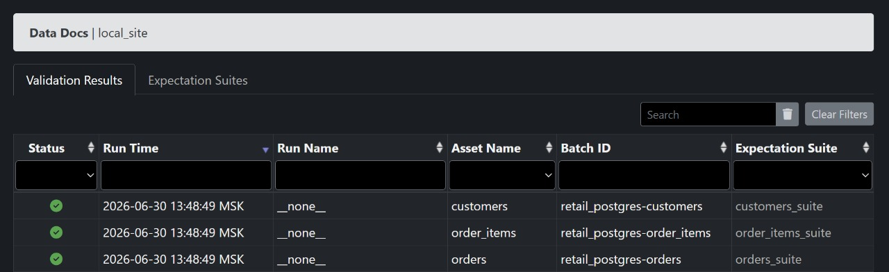
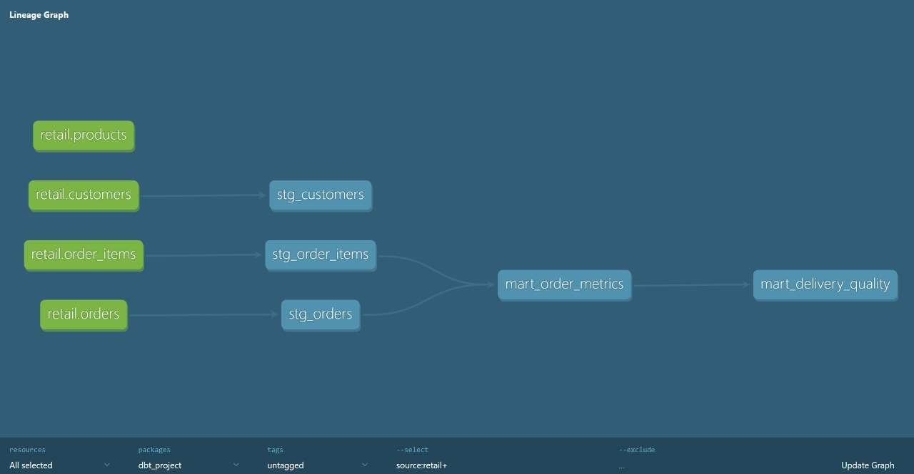
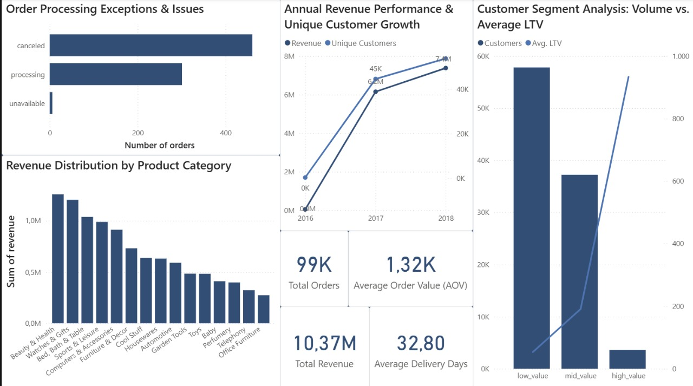

[](https://github.com/VladislavDubinkin/ecommerce-data-quality-pipeline/actions/workflows/ci.yml)

# E-Commerce Data Quality & Analytics Pipeline

End-to-end data pipeline for retail analytics with automated data quality validation, lineage tracking, and business intelligence. Built using the Brazilian E-Commerce (Olist) public dataset — over 3 million records across 7 source tables.

## Architecture

.svg)

Raw CSV files are ingested into PostgreSQL, transformed via PySpark (equivalent to Azure Databricks workloads), modelled with dbt, validated with Great Expectations, and visualised in Power BI. CI/CD via GitHub Actions runs SQL linting and data quality checks on every push.

## Stack

| Layer            | Technology                          |
|------------------|--------------------------------------|
| Ingestion        | Python, SQLAlchemy, pandas           |
| Transformation   | PySpark (Azure Databricks-compatible)|
| Data Modelling   | dbt — staging and mart layers with automated lineage |
| Data Quality     | Great Expectations — 15+ expectations across 3 tables |
| Analytics        | SQL (PostgreSQL) — 5 business views  |
| BI               | Power BI — 5 visualizations          |
| CI/CD            | GitHub Actions — SQL linting + GE validation |
| Infrastructure   | Docker, Docker Compose               |

## Data Quality



15 expectations implemented across `orders`, `order_items`, and `customers` tables, covering:
- Null checks on primary and foreign keys
- Uniqueness constraints (`order_id`, `customer_unique_id`)
- Value range validation (`price`, `freight_value`)
- Domain validation (`order_status` against known set)
- Format validation (Brazilian zip code)

All checks run locally and generate a comprehensive HTML report (Data Docs). GitHub Actions validates SQL syntax and expectation suite structure on every commit.

## Data Lineage & Domain Ownership



Data lineage is automatically generated via `dbt docs generate`, tracing every column from raw source tables through staging models to business-ready marts. This enables transparent data domain ownership — exactly the practice required for the Data Asset Manager role at P&G.

## Dashboard



The Power BI dashboard surfaces:
- Monthly revenue and customer growth trends
- Delivery performance by order status
- Customer lifetime value segmentation
- Top 10 product categories by revenue
- High-level KPIs (total orders, average order value, average delivery days)

## Quick Start

```bash
# 1. Clone and configure
git clone <repo-url>
cd ecommerce-data-quality-pipeline
cp .env.example .env   # fill in your PostgreSQL credentials

# 2. Start PostgreSQL
docker-compose up -d

# 3. Load raw data (place Olist CSVs in data/raw/ first)
python ingestion/load_raw.py

# 4. Run PySpark transformations
python transformations/spark_transform.py

# 5. Run data quality validation
python quality/ge_suite.py

# 6. Build dbt models
cd dbt_project && dbt run && dbt test
